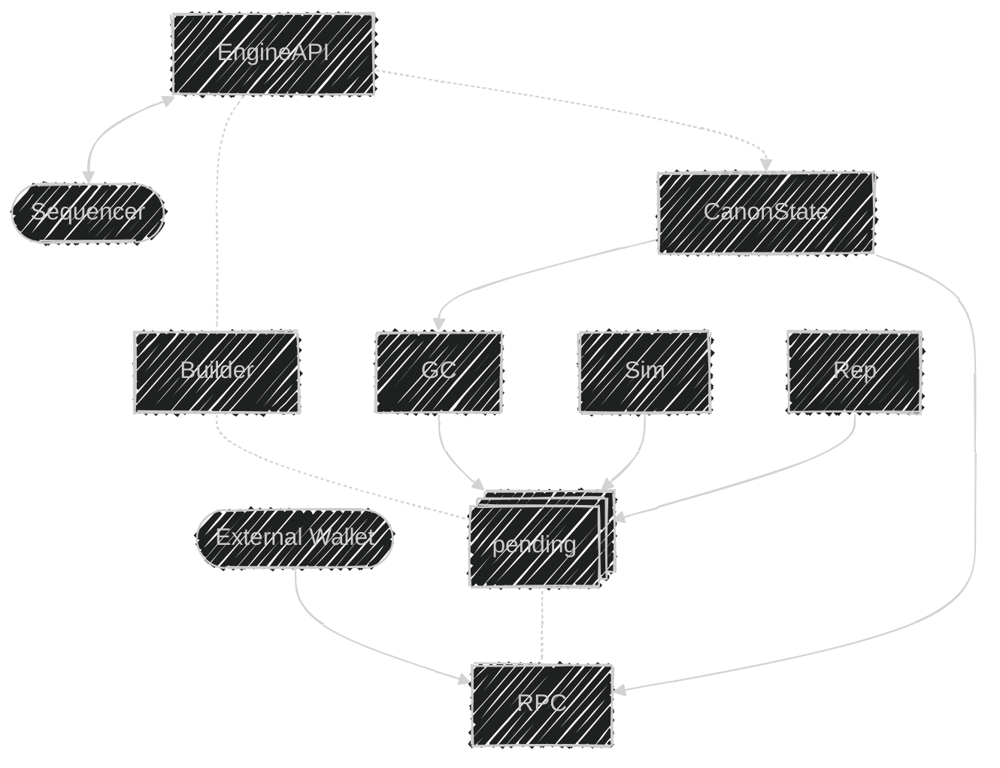

# Mosaik Builder Platform Topology




## Devnet deployment

### Compile actors

```bash
just compile
```

### Start VMs

Starts bare bone ubuntu vms with actor binaries deployed pointing to the beacon node as the bootstrap peer.
Note that the bootstrap peer is addressed by its public key not its transport-level address. The discovery mechanism will
take care of the physical address resolution.

Public key of the bootstrap node is `272a994d8e20a665cac2967b740a9d549960e0d75eee02725cb7b9da351d9b55`.
Nodes connecting to the bootstrap peer should pass `-p 272a994d8e20a665cac2967b740a9d549960e0d75eee02725cb7b9da351d9b55` as a command line parameter.

```bash
just start
```

### Stop VMs

```bash
just compile
```

### Manual start

During development you will most likely need to run actors manually. To do that open a shell to the vm running an actor using 

```bash
multipass shell mosaik-<ACTOR_NAME>
```

e.g.

```bash
multipass shell mosaik-rpc
```

then run

```bash
./rpc -p 272a994d8e20a665cac2967b740a9d549960e0d75eee02725cb7b9da351d9b55
```

If you want to modify actors and have a feedback loop run `just compile` and `just start` and that will update the binaries in the VMs.
