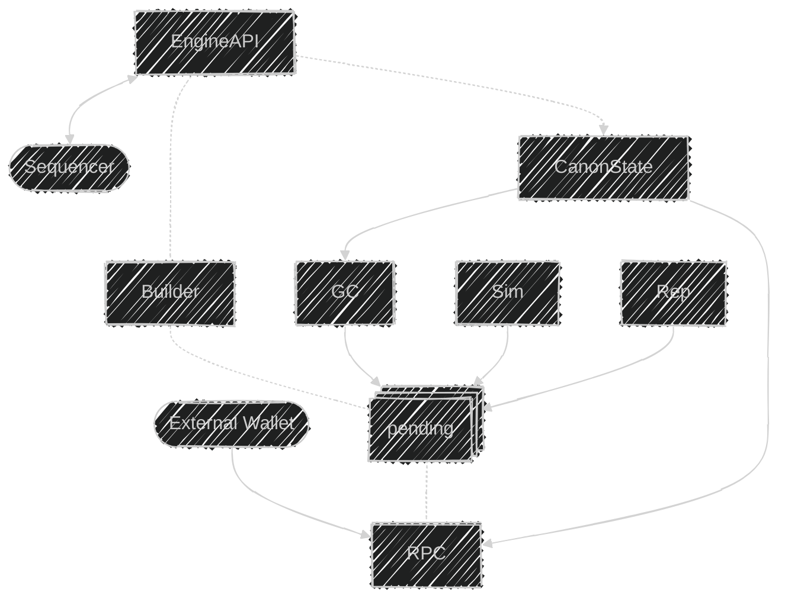

# Mosaik Builder Platform Topology

```mermaid
---
config:
  theme: dark
  layout: fixed
  look: handDrawn
---
flowchart TD
    n1(["External Wallet"]) --> n2["RPC"]
    n7["EngineAPI"] <--> n10(["Sequencer"])
    n7 -.- n6["Builder"]
    n6 -.- n3["pending"]
    n3 -.- n2
    n7 -.-> n5["CanonState"]
    n5 --> n2 & n4["GC"]
    n4 --> n3
    n8["Sim"] --> n3
    n9["Rep"] --> n3
    n2@{ shape: rect}
    n7@{ shape: rect}
    n6@{ shape: rect}
    n3@{ shape: procs}
    n5@{ shape: rect}
    n4@{ shape: rect}
    n8@{ shape: rect}
    n9@{ shape: rect}

```
